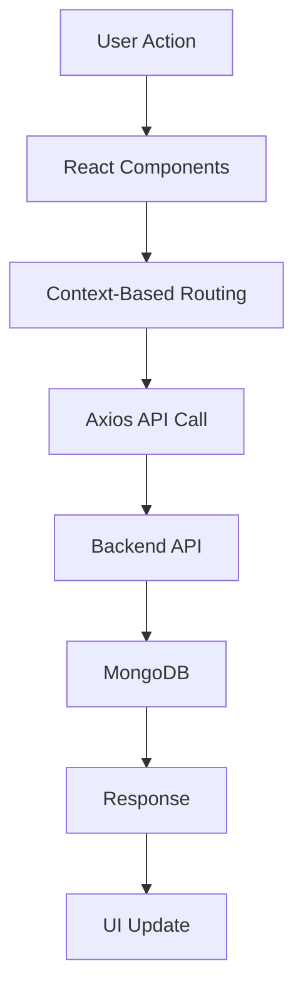

# 🛍️ IndoBuy E-Commerce Frontend

<div align="center">


### 🚀 Modern & Responsive E-Commerce Frontend Application

> Fast • Responsive • Beautiful UI • Scalable Architecture

</div>

---

# 📌 Overview

**IndoBuy Frontend** is a fully responsive modern e-commerce web application built using React.js and Tailwind CSS.

This frontend provides:

- 🔐 Authentication Pages
- 🛍️ Product Browsing
- 🛒 Cart System
- ❤️ Wishlist System
- 💳 Razorpay Payment UI
- 👨‍💻 Admin Dashboard
- 📦 Order Management
- 📱 Responsive Design
- ⚡ Fast Performance
- 🌙 Modern UI/UX

---

# ⚡ Tech Stack

| Technology       | Purpose             |
| ---------------- | ------------------- |
| React.js         | Frontend Library    |
| Vite             | Fast Build Tool     |
| Tailwind CSS     | Styling             |
| Redux Toolkit    | State Management    |
| React Router DOM | Routing             |
| Axios            | API Requests        |
| React Hot Toast  | Notifications       |
| Framer Motion    | Animations          |
| Razorpay         | Payment Integration |
| Cloudinary       | Image Handling      |

---

# 📂 Project Structure

```bash
IndoBuy-Frontend/
│
├── public/
├── src/
│   ├── assets/
│   ├── components/
│   ├── pages/
│   ├── layouts/
│   ├── redux/
│   ├── hooks/
│   ├── services/
│   ├── utils/
│   ├── routes/
│   ├── context/
│   ├── App.jsx
│   └── main.jsx
│
├── package.json
├── vite.config.js
└── tailwind.config.js
```

---

# 🔥 Features

## 👤 User Features

- User Registration & Login
- JWT Authentication
- Product Search
- Product Filtering
- Product Categories
- Add to Cart
- Remove from Cart
- Wishlist Management
- Secure Checkout
- Razorpay Payment
- User Profile
- Order History
- Product Reviews

---

## 🛠️ Admin Features

- Admin Dashboard
- Add Products
- Update Products
- Delete Products
- Manage Orders
- Manage Users
- Analytics UI
- Product Upload System

---

# 🎨 UI Features

- ⚡ Fully Responsive Design
- 🌙 Modern Glassmorphism UI
- ✨ Smooth Animations
- 📱 Mobile Friendly
- 🖥️ Desktop Optimized
- 🎯 Reusable Components
- 🚀 Fast Loading
- 🔥 Clean User Experience

---

# 🧠 Frontend Flow



---

# 🚀 Installation & Setup

## 1️⃣ Clone Repository

```bash
git clone https://github.com/yourusername/indobuy-frontend.git
```

---

## 2️⃣ Move into Project Directory

```bash
cd indobuy-frontend
```

---

## 3️⃣ Install Dependencies

```bash
npm install
```

---

## 4️⃣ Create Environment Variables

```env
VITE_API_URL=http://localhost:5000/api/v1
VITE_RAZORPAY_KEY=your_razorpay_key
```

---

## 5️⃣ Start Development Server

```bash
npm run dev
```

---

# 🌐 Frontend URL

```bash
http://localhost:5173
```

---

# 🔐 Authentication Pages

## 📍 Register Page

### Features

- Form Validation
- Password Protection
- API Integration
- Error Handling
- Toast Notifications

---

## 📍 Login Page

### Features

- JWT Authentication
- Secure Login
- Protected Navigation
- Remember User Session

---

# 🛍️ Product Pages

## 📍 Home Page

### Features

- Featured Products
- Hero Section
- Categories Section
- Trending Products
- Promotional Banner

---

## 📍 Product Listing Page

### Features

- Search Products
- Filter by Category
- Sort Products
- Pagination
- Responsive Product Cards

---

## 📍 Single Product Page

### Features

- Product Images
- Product Description
- Add to Cart
- Wishlist Button
- Product Reviews
- Related Products

---

# 🛒 Cart Functionality

## 📍 Cart Page

### Features

- Add Products
- Remove Products
- Increase Quantity
- Decrease Quantity
- Price Calculation
- Cart Summary

---

# ❤️ Wishlist System

## 📍 Wishlist Page

### Features

- Save Favorite Products
- Remove Wishlist Products
- Move to Cart

---

# 💳 Razorpay Payment Integration

## 📍 Checkout Page

### Features

- Shipping Information
- Order Summary
- Razorpay Payment Popup
- Payment Verification
- Order Confirmation

---

# 📦 Order Management

## 📍 My Orders Page

### Features

- View Orders
- Order Status
- Payment Status
- Product Details

---

# 👨‍💻 Admin Dashboard

## 📍 Dashboard Features

- Product Analytics
- User Analytics
- Revenue Tracking
- Order Statistics
- Charts & Graphs

---

## 📍 Product Management

### Features

- Create Product
- Edit Product
- Delete Product
- Upload Product Images
- Manage Inventory

---

# ⚙️ Redux State Management

## 📍 Store Configuration

```js
configureStore({
  reducer: {
    auth: authReducer,
    cart: cartReducer,
    product: productReducer,
    order: orderReducer,
  },
});
```

---

## 📍 Redux Purpose

Redux is used for:

- Global State Management
- User Authentication State
- Cart State
- Product Data
- Order Data
- Better Performance

---

# 🌐 Axios API Integration

## 📍 Axios Setup

```js
const API = axios.create({
  baseURL: import.meta.env.VITE_API_URL,
  withCredentials: true,
});
```

---

## 📍 Purpose

Axios helps to:

- Send API Requests
- Receive Backend Data
- Handle Errors
- Manage Authentication Headers

---

# 🧩 Reusable Components

## 📍 Navbar Component

### Features

- Navigation Links
- Search Bar
- Cart Counter
- Wishlist Counter
- Responsive Menu

---

## 📍 Product Card Component

### Features

- Product Image
- Product Price
- Add to Cart Button
- Wishlist Button
- Responsive Design

---

## 📍 Footer Component

### Features

- Social Media Links
- Navigation Links
- Copyright Section

---

# 🎨 Tailwind CSS Styling

## 📍 Utility Classes

```html
<div class="flex items-center justify-between p-4 rounded-xl shadow-lg"></div>
```

---

## 📍 Benefits

- Faster UI Development
- Responsive Design
- Clean Styling
- Reusable Utility Classes

---

# ⚡ Performance Optimization

## 📍 Optimization Techniques

- Lazy Loading
- Code Splitting
- Optimized Images
- Memoization
- API Caching
- Reusable Components

---

# 📱 Responsive Design

## 📍 Supported Devices

- Mobile Phones
- Tablets
- Laptops
- Desktop Screens

---

# 🔒 Security Features

- Protected Routes
- JWT Authentication
- Secure API Calls
- Environment Variables
- Input Validation
- Role-Based Access

---

# 📡 API Communication Flow

```js
Frontend → Axios → Backend API → MongoDB → Response → UI Update
```

---

# 📜 Example React Component

## 📍 Product Card

```jsx
const ProductCard = ({ product }) => {
  return (
    <div className="p-4 shadow-lg rounded-xl">
      
      <h2>{product.title}</h2>
      <p>₹{product.price}</p>
      <button>Add To Cart</button>
    </div>
  );
};
```

---

# 🧪 Testing

You can test frontend using:

- Chrome DevTools
- Lighthouse
- Responsive Device Toolbar

---

# 🚀 Deployment

## Deploy Frontend on:

- Vercel
- Netlify
- Firebase Hosting
- AWS Amplify
- Render

---

# 📈 Future Improvements

- 🤖 AI Product Recommendation
- 🌍 Multi Vendor Marketplace
- 💬 Real-Time Chat Support
- 🔔 Push Notifications
- 📱 React Native Mobile App
- 🌐 Multi Language Support
- 🌙 Dark Mode Toggle

---

# 🤝 Contributing

```bash
Fork the repository
Create a feature branch
Commit your changes
Push the branch
Create Pull Request
```

---

# 📞 Contact

## 👨‍💻 Developer

### Saurabh Singh

- MERN Stack Developer
- Frontend Developer
- GenAI Enthusiast

---

# ⭐ Support

If you like this project:

- 🌟 Star this repository
- 🍴 Fork this repository
- 🚀 Share with developers

---

# 📜 License

This project is licensed under the MIT License.

---

<div align="center">

# ❤️ Thank You For Visiting IndoBuy Frontend

### 🚀 Happy Coding Bro!

</div>
